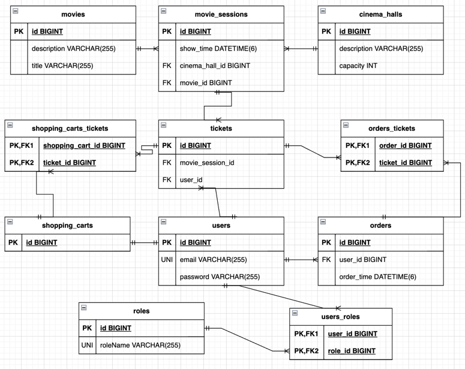

# Cinema-app
## Description
***
**The cinema app is web-based application that allow users to view movie session details and make orders. 
The application is build on both SOLID and REST concepts and leverages the Spring and Hibernate frameworks, guaranteeing a streamlined and efficient user interaction. 
Role-based authentication ensures that resource access aligns with user privileges.**
## Project Structure
***
* **DAO Package (Data Access Layer):** This package encapsulates functions that primarily interact with the database. 
It handles data retrieval, storage, and manipulation operations. 
This separation ensures that database-related operations remain independent of the application's business logic.
* **Service Package (Application Logic Layer):** The core functionality of the application resides in this package. 
It manages the business logic, processing data retrieved from the DAO layer. 
This layer ensures that the application's rules and operations are carried out seamlessly and efficiently.
* **Controllers Package (Presentation Layer):** This package is responsible for handling the presentation and interaction aspects of the application. 
It uses servlets to manage HTTP requests from the web.
* **Config Package:** Within this package, essential configurations are stored. 
It manages the creation of database connections. It also handles role-based permissions, 
dictating which roles have access to specific HTTP methods, enhancing security and access control.

## Features
These are all requests that can be handled by this app. They are listed below:

| Role       | Http method | Endpoint                       | Path variable, Request param | Json body                       | Description                            |
|------------|-------------|--------------------------------|------------------------------|---------------------------------|----------------------------------------|
| ADMIN      | POST        | /cinema-halls                  |                              | capacity, description           | add cinema hall to db                  |
| ADMIN      | POST        | /movies                        |                              | title, description              | add movie to db                        |
| ADMIN      | POST        | /movie-sessions                |                              | movieId, cinemaHallId, showTime | add session to db                      |
| ADMIN      | PUT         | /movie-sessions                | /{id}                        | movieId, cinemaHallId, showTime | update session in db                   |
| ADMIN      | DELETE      | /movie-sessions                | /{id}                        |                                 | delete session from db                 | 
| ADMIN      | GET         | /users/by-email                | ?email                       |                                 | get user from db                       | 
| USER       | GET         | /orders                        |                              |                                 | get all orders by this user from db    | 
| USER       | GET         | /shopping-carts/by-user        |                              |                                 | get shopping cart by this user from db | 
| USER       | PUT         | /shopping-carts/movie-sessions | ?userId&movieSessionId       |                                 | add tickets to shopping cart           | 
| USER       | POST        | /orders/complete               |                              |                                 | add order to db                        | 
| USER/ADMIN | GET         | /cinema-halls                  |                              |                                 | get all cinema halls from db           | 
| USER/ADMIN | GET         | /movies                        |                              |                                 | get all movies from db                 | 
| USER/ADMIN | GET         | /movie-sessions/available      | ?movieId&date                |                                 | get available movie session from db    | 
| ALL        | POST        | /register                      |                              | email, password, repeatPassword | get available movie session from db    | 
| ALL        | POST        | /login                         |                              | email, password                 | authorize to application with role     | 

## Technology
***
The project incorporates the following technologies:

* Java
* Apache Maven
* Apache Tomcat
* Spring MVC
* Spring Security
* Hibernate
* MySQL
* JDBC

## Database Structure
***
The following schema illustrates the relationships between various entities and their arrangement within the database:

<br />These entities are interconnected via primary and foreign keys, 
establishing a structured and organized database layout.

## Running the Project
***
To launch this project successfully, follow these steps:
1. **Install Prerequisites:**

* Make sure you have IntelliJ IDEA, MySQL, and Apache Tomcat installed on your system.
2. **Clone the Project:**
* Clone the project repository to your local machine using Git.

3. **Configure Database:**

* Open the project in IntelliJ IDEA.
* Navigate to `src/main/resources/db.properties` and update the `db.user` and `db.password` parameters to match your MySQL credentials.
4. **Create the Database:**

* Open a terminal and run: `mysql -u root -p`
* Enter your MySQL root password.
* Run: `create database cinema;` to create the necessary database.
5. **Configure Tomcat in IntelliJ IDEA:**

* Open IntelliJ IDEA.
* Go to "Run" menu, choose "Edit Configurations..."
* Click the '+' button and select "Tomcat Server" -> "Local".
* Set the Tomcat Home directory and JRE.
* Under "Deployment" tab, add an artifact of type "war exploded".
6. **Run the Application:**

* Run the configured Tomcat server by clicking on the green "Run" button in IntelliJ IDEA.
7. **Access the Application:**

* Launch your web browser and navigate to `http://localhost:8080`.
* You can log in as an admin or a regular user using the following credentials:
``` 
Admin Role:
Username: nigel@gmail.com
Password: 12345678

User Role:
Username: bob@in.ua
Password: 12345678
```
* These users have already been added to the database after running the program. 
Choose the appropriate role for your login to access the application's features.
* By following these steps, you'll be able to set up and run the project successfully on your local system. Make sure to adapt any specific configurations based on your environment and preferences.